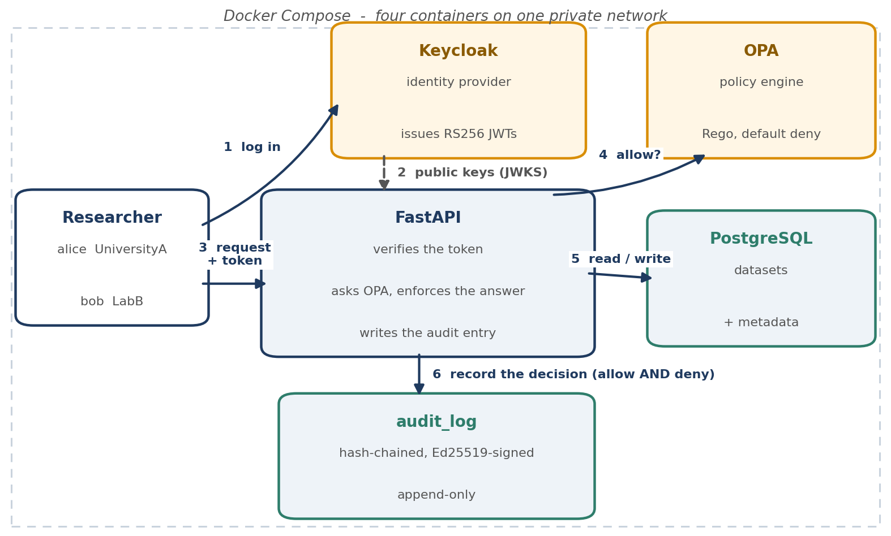
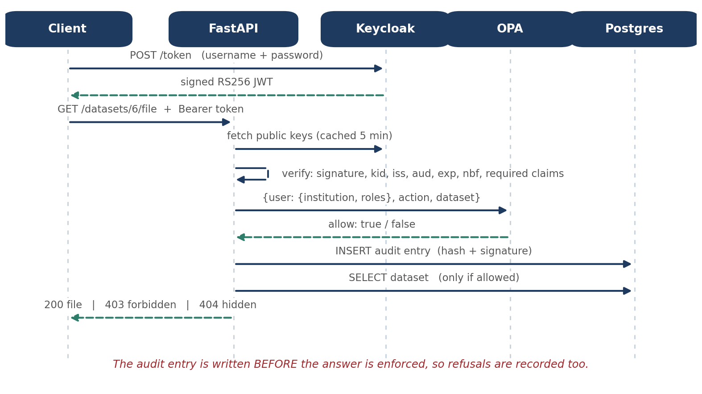
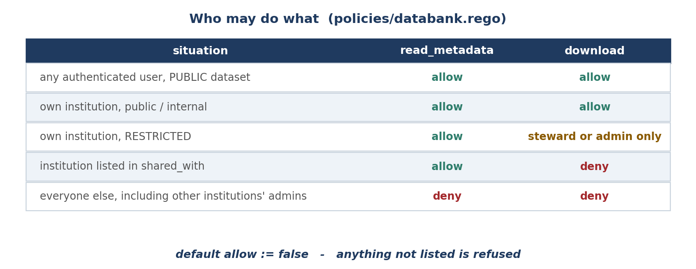
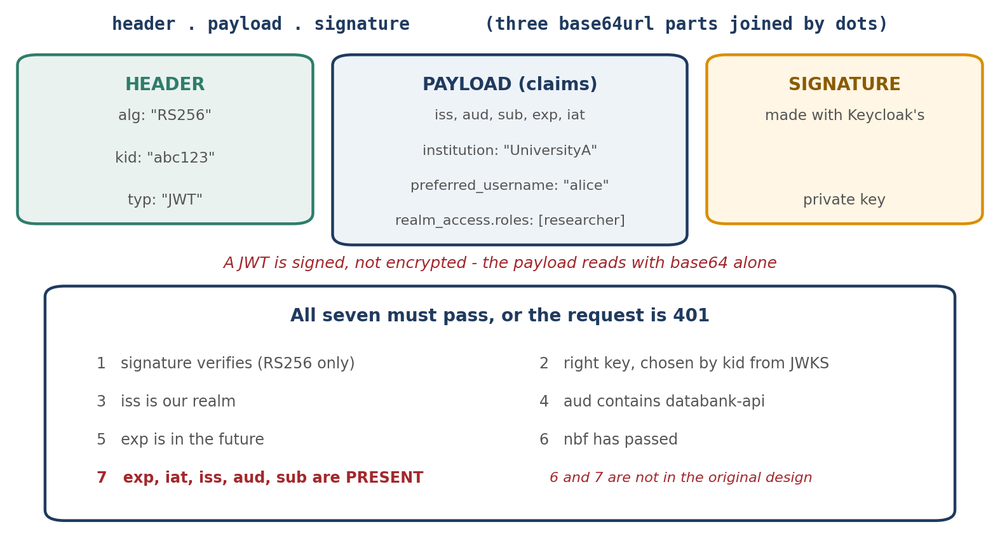
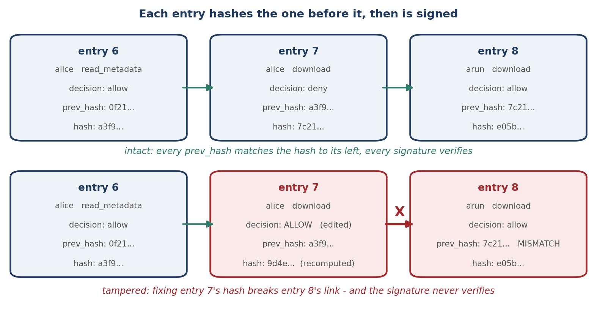

# Secure Research Data Bank

A multi-institution research data service, built one security layer at a time.
Researchers from two simulated institutions (`UniversityA`, `LabB`) upload and
access datasets. Every request is authenticated, checked against an external
policy engine, and written to a tamper-evident audit log.

Built as a portfolio project to work through four questions end to end:

| Layer | Question | How |
|---|---|---|
| Authentication | Who are you? | Keycloak (OAuth2 / OIDC), RS256 JWTs verified via JWKS |
| Authorization | What may you do? | Open Policy Agent, Rego policy, default deny |
| Accountability | What happened? | Hash-chained, Ed25519-signed, append-only log |
| Assurance | Does it hold up? | 31 pytest attack tests, 19 Rego tests, rate limiting |

Stack: Python, FastAPI, PostgreSQL, Keycloak, Open Policy Agent, Docker Compose.

---

## Quick start

```bash
cp .env.example .env          # then fill in real values (see below)
docker compose up -d --build
python scripts/seed.py        # loads public NOAA climate data
```

`.env` needs: two database credentials, a Keycloak admin password, the client
secret from **Clients → databank-api → Credentials**, a dev user password, and
an Ed25519 key pair for signing audit entries:

```bash
docker compose exec api python -c "from cryptography.hazmat.primitives.asymmetric.ed25519 import Ed25519PrivateKey; from cryptography.hazmat.primitives import serialization as ser; import base64; k=Ed25519PrivateKey.generate(); print('AUDIT_SIGNING_KEY='+base64.b64encode(k.private_bytes(ser.Encoding.Raw, ser.PrivateFormat.Raw, ser.NoEncryption())).decode()); print('AUDIT_PUBLIC_KEY='+base64.b64encode(k.public_key().public_bytes(ser.Encoding.Raw, ser.PublicFormat.Raw)).decode())"
```

Realm configuration is in `keycloak/` — see `keycloak/README.md` for importing
it and recreating the four demo users.

## Architecture






Users never talk to OPA, the database or the log. The audit entry is written
for denied requests too, before the answer is enforced.

## Security controls

| Control | Where | Stops |
|---|---|---|
| RS256 signature, key chosen by `kid` from JWKS | `app/auth.py` | Forged tokens, `alg:none`, RS256→HS256 confusion |
| Issuer, audience, expiry, not-before checks | `app/auth.py` | Tokens from another realm, another service, or replayed |
| Required claims (`exp, iat, iss, aud, sub`) | `app/auth.py` | Tokens that *omit* a claim rather than mismatching it |
| Institution and roles taken from the token | `app/main.py` | A client declaring which institution owns its upload |
| Default-deny Rego policy | `policies/databank.rego` | Any access not explicitly permitted |
| 404 for invisible, 403 for forbidden | `app/main.py` | Catalogue enumeration by reading status codes |
| Fail closed (503) when OPA is unreachable | `app/policy.py` | A policy-engine outage becoming an access bypass |
| Hash chain + Ed25519 signatures | `app/audit.py` | Rewriting history, even with full database access |
| Append-only trigger | `app/audit.py` | Accidental and casual modification of the log |
| Advisory lock on append | `app/audit.py` | Concurrent writes forking the chain |
| Sliding-window rate limit | `app/ratelimit.py` | Flooding the API; tighter limit on downloads |
| Keycloak brute-force detection | realm setting | Password guessing (which never reaches the API) |
| Random storage filenames, `open("xb")` | `app/main.py` | Path traversal, silent overwrites |
| Forced `application/octet-stream` + `nosniff` | `app/main.py` | Stored XSS from an uploaded HTML file |



## Threat model (STRIDE)

| Threat | Example here | Defence | Residual risk |
|---|---|---|---|
| **S**poofing | Forged or `alg:none` JWT | Signature verified against JWKS, algorithm pinned to RS256, issuer and audience checked | A stolen valid token works until it expires (300s) |
| **T**ampering | Editing the audit log to erase a denial | Hash chain, Ed25519 signatures, append-only trigger | Truncation of the newest entries between anchors |
| **R**epudiation | "I never downloaded that dataset" | Every request logged with actor, action, dataset, decision, source address and request id | An attacker who compromises the *application* holds the signing key |
| **I**nformation disclosure | IDOR on dataset IDs; catalogue enumeration | Per-request OPA check on every route including listings; 404 rather than 403 when a dataset must stay invisible | Metadata visible to shared institutions by design |
| **D**enial of service | Request flooding; login guessing | Sliding-window rate limit, tighter on downloads; Keycloak brute-force lockout; upload size cap; paging caps | In-process limiter does not span replicas |
| **E**levation of privilege | Researcher acting as data steward; user editing their own institution | Roles and institution come from signed claims; `institution` is admin-writable only; default-deny policy | Compromise of a Keycloak admin account |

## NIST 800-53 mapping

Access control (AC) and audit (AU) families, mapped to what is actually
implemented rather than aspirational:

| Control | Requirement (paraphrased) | Implementation |
|---|---|---|
| AC-2 | Account management | Keycloak realm; accounts, roles and the `institution` attribute managed centrally; attribute is admin-writable only |
| AC-3 | Access enforcement | Every dataset route asks OPA before acting; `default allow := false` |
| AC-4 | Information flow enforcement | Sharing grants metadata visibility only; files never cross institutions unless the dataset is public |
| AC-6 | Least privilege | Restricted downloads require `data_steward` or `admin` *within* the owning institution; admins have no cross-institution power |
| AC-7 | Unsuccessful logon attempts | Keycloak brute-force detection: 5 failures, 60s lockout growing to 900s, temporary not permanent |
| AC-24 | Access control decisions | Decisions are made by a separate policy engine and are independently testable (`opa test`) |
| AU-2 | Event logging | Every authorization decision, allow and deny, plus uploads and audit-log reads |
| AU-3 | Content of audit records | Timestamp, actor, subject, institution, roles, action, dataset, decision, reason, source address, request id |
| AU-6 | Audit review | `GET /audit`, restricted to the `admin` role through the same policy engine |
| AU-9 | Protection of audit information | Append-only trigger, hash chain, Ed25519 signatures with the key outside the database, external anchoring |
| AU-10 | Non-repudiation | Signed entries; the application's key is not in the database an attacker would compromise |
| AU-12 | Audit record generation | Generated in-process on every request, before the response is returned |

## The two cryptographic pieces





## Design decisions

**Policy in OPA, not in Python.** The rules are 79 lines of Rego a reviewer can
audit without reading the application, they are tested in milliseconds against
no database or API, and every endpoint asks the same engine the same question —
so a rule cannot be applied on one route and forgotten on another.

**Default deny.** Every rule can only *add* permission, so a typo or an
unhandled case denies. In a default-allow policy the same mistake silently
grants access.

**404 for invisible, 403 for forbidden.** Returning 403 for a dataset the caller
may not know about confirms the ID is real, which lets an attacker map the
catalogue by walking IDs and reading status codes. Where the caller can already
see the dataset, 403 is honest and actionable.

**Admins are scoped to their institution.** This diverges from the original
design sketch, which had a global admin override. Institutions are tenant
boundaries; a global override means one compromised admin account defeats every
boundary at once. The single exception is reading the audit log, which spans
institutions because integrity oversight is not access to research data.

**Ed25519 rather than HMAC for audit signatures.** With an HMAC, the key that
verifies is the key that signs, so anyone who can check the log can forge it.
With Ed25519 the public key can be published and an external auditor can verify
integrity without gaining any ability to write.

**Fail closed.** If OPA is unreachable the API returns 503 rather than making a
decision. An authorization layer that allows when its policy engine is down
turns a dependency outage into a total bypass.

**The uploader does not declare ownership.** In the Week 1 baseline,
`owner_institution` was whatever the client sent. It now comes from a signed
claim, verified by `tests/test_authentication.py::test_institution_comes_from_the_token_not_the_request`.

## Known limitations

Stated deliberately; each is a real gap rather than an oversight.

- **Audit log truncation.** Deleting the newest entries leaves a log that still
  links correctly and verifies. `scripts/anchor.ps1` records the tip hash
  outside the database and the anchor file is committed to Git, which bounds
  the damage to one anchoring interval but cannot close it.
- **Application compromise.** Signatures prove the log came from the
  application, not that the application was honest. Whoever holds the signing
  key can write anything from that point on.
- **No expired-token test.** Testing expiry honestly needs a real wait or a
  reconfigured token lifespan; a fake expired token fails the signature check
  first and would test the wrong thing. Expiry is verified manually.
- **Rate limiting is in-process.** Two API replicas mean two independent
  counters. Production needs a shared store or edge enforcement.
- **Upload size limit is enforced late.** FastAPI buffers the request body
  before the handler runs, so the 50 MB cap governs what is *stored*, not what
  is *received*. The hard limit belongs at a reverse proxy.
- **`create_all` instead of migrations.** SQLAlchemy cannot alter an existing
  table, so the audit schema change required dropping it. Alembic is the right
  answer, and for an append-only log the migration is genuinely interesting:
  history cannot be rewritten to backfill, so entries must be verified under the
  rules that applied when they were written.
- **Orphaned files.** Deleting a dataset row leaves its file on disk. Files and
  rows should be removed together in a transaction.
- **Local files, not object storage.** Production would use S3 with pre-signed
  URLs so large files do not stream through the API.
- **Development configuration.** Keycloak runs in `start-dev` (no HTTPS,
  embedded H2). OPA runs with `--watch`, which is convenient locally but wrong
  in production, where policies are versioned bundles rolled out deliberately.
  The client uses the OAuth resource-owner password grant so tokens can be
  requested from a shell; real clients should use authorization code with PKCE,
  which is why that grant is removed in OAuth 2.1.

## Testing

Policy tests, no application required:

```bash
docker compose run --rm opa test /policies -v      # 19 tests
```

Attack suite against the running stack:

```bash
python -m pip install pytest httpx
python -m pytest                                    # 31 tests
```

What the attack suite proves: no token, garbage token, tampered token,
`alg:none` forgery and wrong-audience token are all rejected; the uploader
cannot declare ownership; the 12-case access matrix holds end to end; a
collection endpoint hides what the item endpoint hides; role claims cannot be
asserted through headers; denials are recorded; audit entries link to their
predecessors; tampering is detected even when the attacker recomputes the hash;
and flooding is throttled while `/health` stays reachable.

The live access matrix can also be run on its own:

```bash
powershell -ExecutionPolicy Bypass -File scripts/check-policy.ps1
```

## Repository layout

```
app/
  main.py        routes, enforcement, audit calls
  auth.py        JWT verification (JWKS, RS256, iss/aud/exp/nbf, required claims)
  policy.py      OPA client; fails closed
  audit.py       hash chain, Ed25519 signatures, verify_chain, append-only trigger
  ratelimit.py   sliding-window limiter
  db.py          engine, session, Dataset model
  schemas.py     enums and response models
policies/
  databank.rego        access rules, default deny
  databank_test.rego   19 policy tests
keycloak/
  realm-export.json    realm, client and mappers (secret redacted)
  README.md            setup, user recreation, and the traps hit along the way
tests/                 pytest attack suite
scripts/
  seed.py              loads public NOAA datasets through the API
  check-policy.ps1     live access matrix
  anchor.ps1           records the audit tip hash outside the database
audit-anchors.txt      append-only anchor record, committed
```

## Data

Seeded with NOAA Global Historical Climatology Network daily observations,
obtained through the AWS Open Data registry (`noaa-ghcn-pds`). US federal
government work, public domain.
